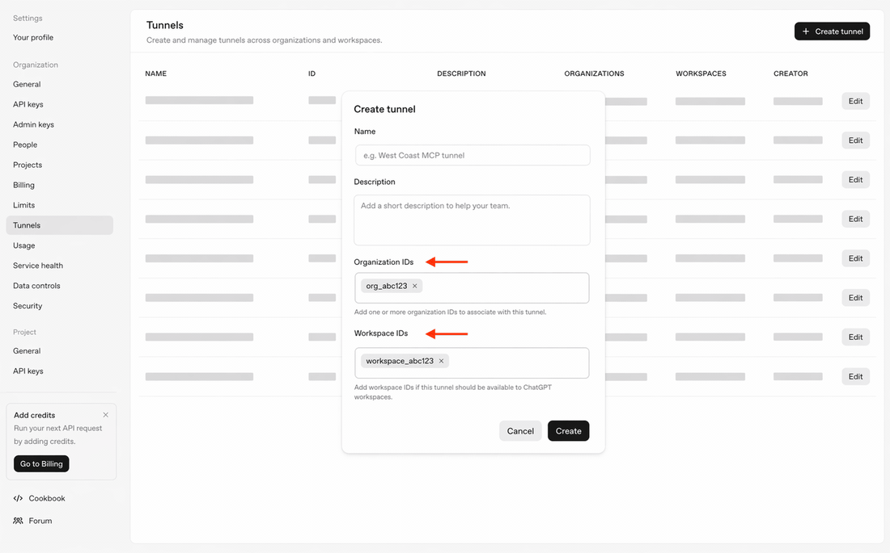
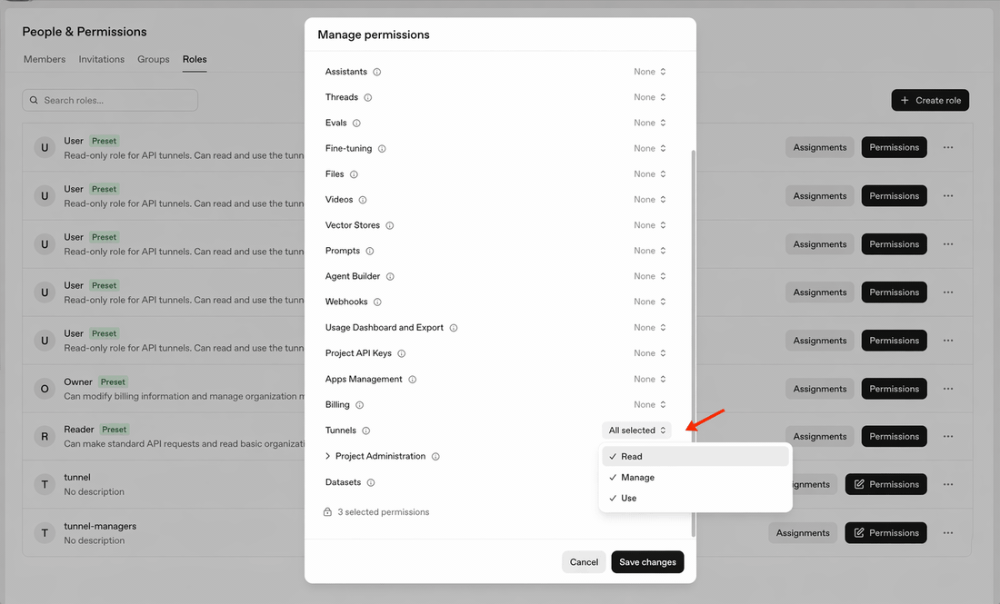
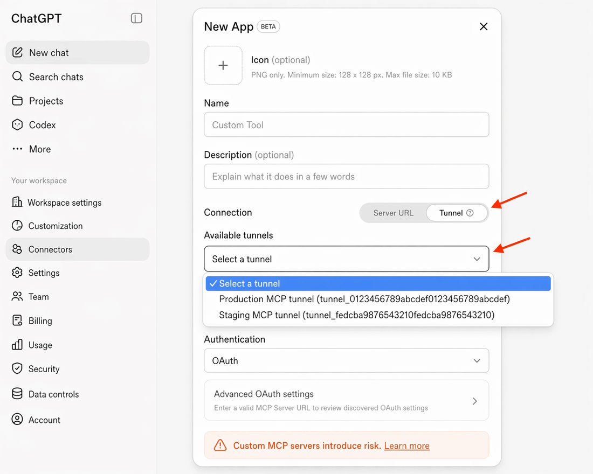

# Connect ChatGPT on the web: an illustrated beginner tutorial

**English** | [简体中文](CHATGPT_SETUP.zh-CN.md) · [Back to README](../README.md)

**Goal:** select `mcp-dev-runtime` in a ChatGPT conversation and use the local service for development operations you authorize. This creates your own developer-mode app, not an Action under “Explore GPTs → Create a GPT,” and not a public plugin-store submission.

Web entry points and official references reviewed: **2026-09-20**. Accounts may show Plugins, Apps, or Connectors. The guide provides a main route and an alternative; unavailable permissions require an administrator or official support, not a workaround that bypasses access controls.

This walkthrough targets **project 1.2.0 / tool contract 3.1**. The signed-in account pages must be opened in your own browser; reviewing public documentation is not a claim of having inspected your account's current UI. Complete each checkpoint before moving on. In particular, do not scan tools before both local services are online.

> **Key safety:** never put a real API key in chat, screenshots, a README, or GitHub. Complete configuration in your own browser and terminal. The runtime executes with the service user's OS permissions and has no additional sandbox; read [security guidance](../SECURITY.md) first.

## The whole process

[Check accounts](#step-0) → [Enable developer mode](#step-1) → [Install locally](#step-2) → [Create a Tunnel and copy its ID](#step-3) → [Create an API key](#step-4) → [Fill in local configuration](#step-5) → [Start services](#step-6) → [Create the ChatGPT app and choose Tunnel](#step-7) → [Make the first call](#step-8).

| Purpose | Official page |
| --- | --- |
| ChatGPT on the web | [chatgpt.com](https://chatgpt.com/) |
| Create a developer-mode app | [ChatGPT Plugins](https://chatgpt.com/plugins) |
| Earlier Apps / Connectors settings | [ChatGPT Connectors](https://chatgpt.com/#settings/Connectors) |
| Create a runtime API key | [Platform → Organization → API keys](https://platform.openai.com/settings/organization/api-keys?utm_source=chatgpt.com) |
| Create a tunnel or find its ID | [Platform → Organization → Tunnels](https://platform.openai.com/settings/organization/tunnels) |
| Find an Organization ID | [Platform → Organization → General](https://platform.openai.com/settings/organization/general) |
| Manage tunnel permissions | [Platform → Organization roles](https://platform.openai.com/settings/organization/people/roles) |

The `utm_source=chatgpt.com` part of the API keys link is a referral parameter. [Without it](https://platform.openai.com/settings/organization/api-keys), the link still uses the same settings path; it is not part of a key.

### Four values that are easy to confuse

| Name | Example or format | Where it belongs |
| --- | --- | --- |
| App name | `mcp-dev-runtime` | Name in ChatGPT's app-creation form |
| Tunnel ID | `tunnel_` followed by 32 lowercase hexadecimal characters | Local `CONTROL_PLANE_TUNNEL_ID`; ChatGPT's tunnel selection or ID field |
| Runtime API key | The complete secret shown when the key is created | **Only in local configuration** as `CONTROL_PLANE_API_KEY`; the Tunnel client uses it to authenticate to OpenAI at runtime |
| Local MCP address | `http://127.0.0.1:3001/mcp` | The service that the local Tunnel client forwards to; not a Tunnel ID |

The API keys page does not generate Tunnel IDs. An organization ID, workspace ID, tunnel display name, or tool execution `session_id` cannot replace a Tunnel ID either.

<a id="step-0"></a>
## Step 0 — Confirm the accounts and target workspace

Sign in to ChatGPT in your browser and identify whether you will use a personal, company, or school workspace. In another tab, sign in to OpenAI Platform and select the organization you are authorized to use. For first-time setup, using the same account with access to both resources reduces accidental account mismatches.

**ChatGPT developer-mode access, Platform organization permissions, and key permissions are separate.** A subscription, source checkout, or ordinary API key does not automatically grant all three.

The current [developer guide](https://developers.openai.com/api/docs/guides/developer-mode) and [Help Center article](https://help.openai.com/en/articles/12584461-developer-mode-and-mcp-apps-in-chatgpt) do not describe identical interfaces or account availability. This guide starts with the developer-guide route and provides the Help Center alternative. Your account's actual availability and workspace policy take precedence; a plan name alone is not a guarantee of every permission.

**Checkpoint:** you know which ChatGPT workspace and Platform organization you intend to connect, rather than unknowingly using different accounts across tabs.

<a id="step-1"></a>
## Step 1 — Enable developer mode in ChatGPT on the web

Follow the current [official developer guide](https://developers.openai.com/api/docs/guides/developer-mode):

1. Open [ChatGPT](https://chatgpt.com/), open your profile/account menu, and choose **Settings**.
2. Open **Security and login**.
3. Find **Developer mode**, review the warning, and enable it.
4. Open [Plugins](https://chatgpt.com/plugins) and confirm that the page's **plus button** can create a developer-mode app. Locate the entry point for now; you do not need to submit the form yet.

**If that toggle is missing:** look under **Settings → Apps → Advanced Settings → Developer mode**. Earlier interfaces may call Apps “Connectors.” The Help Center also documents an administrator route through **Workspace settings → Apps → Create**. Managed workspaces may first require an administrator to grant access under **Permissions & Roles → Connected Data**. A permission problem is not a local installation failure. See the [official help](https://help.openai.com/en/articles/12584461-developer-mode-and-mcp-apps-in-chatgpt).

This is not the browser's F12 developer-tools panel, and it does not require experimental browser settings.

**Checkpoint:** developer mode is enabled for your account, and you can find the custom-app creation entry point.

<a id="step-2"></a>
## Step 2 — Install the precompiled runtime

Open a terminal on the computer you want ChatGPT to access. Follow the [precompiled installation guide](BINARY_INSTALL.md): choose the matching v1.2.0 archive, verify its SHA-256 against `SHA256SUMS`, and extract it. Run `./install.sh` on macOS/Linux or `.\install.ps1` in Windows PowerShell; Windows users should follow the [Windows guide](WINDOWS.md). The runtime includes Node, native dependencies and the pinned Tunnel; no Node/npm/Go/compiler installation is required. Publisher signing and Apple notarization are intentionally skipped, so review any OS approval before running downloaded software.

For Apple Silicon, after downloading and verifying:

```bash
tar -xzf mcp-dev-runtime-1.2.0-darwin-arm64.tar.gz
cd mcp-dev-runtime-1.2.0-darwin-arm64
./install.sh
```

Use the filename for your platform on Linux or Intel Mac. The installer copies a versioned program directory, creates only missing user configuration, and registers `mcp-dev-runtime` plus `mdr` when conflict-free. It does not start a service or download dependencies. If the short command was skipped, substitute `mcp-dev-runtime` for every `mdr` below. Follow the printed PATH instruction when needed:

```bash
export PATH="$HOME/.local/bin:$PATH"
mdr paths
mdr doctor --offline
```

`mdr paths` shows actual configuration/log locations, not proposed future directories. The generated runtime config defaults to your home directory; change `cwd` to an existing absolute workspace if needed. It is a default directory, not a filesystem allowlist. Keep loopback binding and never run MDR with sudo.

**Checkpoint:** installation completes and offline doctor passes. This establishes local installation, not a live Tunnel connection. Existing source checkouts can keep their [source workflow](../README.md#install); do not run npm setup inside a precompiled package or overwrite source-owned command entries. Log instructions: [README logs](../README.md#logs).

<a id="step-3"></a>
## Step 3 — Create a Tunnel and find its real ID

### 3.1 Open the correct page

Go to [Platform → Organization → Tunnels](https://platform.openai.com/settings/organization/tunnels) and check the selected organization. If you already have a tunnel you are authorized to use, open that record instead of creating a duplicate.

Otherwise, select **Create tunnel**. The fields in the reference illustration mean:

| Field | What to enter |
| --- | --- |
| Name | A recognizable computer label such as `my-mac-dev`; not the Tunnel ID |
| Description | A brief purpose description, as requested by the form |
| Organization IDs | Select or enter the actual Platform organization ID; do not copy the illustration's placeholders |
| Workspace IDs | Associate the ChatGPT workspace you intend to use, particularly for discovery in that workspace's tunnel picker |



*Source: the OpenAI tunnel-client repository's [Create tunnel reference image](https://github.com/openai/tunnel-client/blob/70bb5a7e1305596f0216d7b18d0b7765d58576d5/docs/images/tunnel-create-modal.png). This is an illustration with placeholder data, not a screenshot of your account.*

### 3.2 Where do organization and workspace IDs come from?

Look for the Organization ID in [Platform organization General](https://platform.openai.com/settings/organization/general). For ChatGPT workspaces with administrative settings, open the profile menu, then **Workspace settings → General**, and find the workspace identifier. The official [workspace settings article](https://help.openai.com/en/articles/8411955-managing-workspace-settings-in-chatgpt-enterprise) lists workspace and organization identifiers under General.

If associations are already filled in or offered through a picker, confirm and select them. If you cannot find the workspace ID, your personal account lacks that administration view, or a required field offers no valid option, ask the administrator or OpenAI support to confirm the association. Do not substitute an email, chat URL, or Platform project ID. An association with a Platform organization alone does not guarantee visibility in the target ChatGPT workspace.

### 3.3 Copy the ID after creation

After choosing **Create**, return to the Tunnels list and copy the **complete ID** from the new record's **ID** column or detail view. If the list abbreviates it, use its copy control or open the detail page rather than copying an ellipsis.

The real format is `tunnel_` followed by 32 lowercase hexadecimal characters. Keep this ID: local configuration and ChatGPT's connection must refer to the **same tunnel**. The ID is not a password, but actual deployment identifiers should not be published casually.

Creating/managing tunnels requires **Read + Manage**; running/selecting one requires **Read + Use**. A newly created record may take about 25–30 seconds to become available. Role propagation can take longer; current official troubleshooting allows up to approximately 30 minutes. Do not repeatedly create identically named tunnels to work around permissions. [Permission guide](https://github.com/openai/tunnel-client/blob/master/docs/permissions.md) · [Official troubleshooting](https://developers.openai.com/api/docs/guides/secure-mcp-tunnels#troubleshooting)

**Checkpoint:** you have copied a real Tunnel ID and confirmed its target workspace association and use permissions.

<a id="step-4"></a>
## Step 4 — Create the runtime key on the API keys page

Open **[Platform → Organization → API keys](https://platform.openai.com/settings/organization/api-keys?utm_source=chatgpt.com)**. Use the organization and identity authorized for the target tunnel. Do not switch to the adjacent **Admin keys** page.

1. Select **Create new secret key**, or the equivalent create-key action if the label differs.
2. If a Name field appears, use a recognizable label such as `mcp-dev-runtime-local`. If identity or project selection is required, use the context in that organization already authorized for the target tunnel.
3. Set Permissions to **Restricted**. Following the [official tunnel permission guide](https://github.com/openai/tunnel-client/blob/master/docs/permissions.md#creating-keys), grant the required **Tunnels → Read + Use**. Do not choose All or an admin key merely to avoid configuring permissions.
4. Create the key and copy the **complete secret** to a secure local location for `runtime.env` in the next step. A masked list entry is not the full secret. If the full value is no longer retrievable, create a replacement and revoke the obsolete key.

The key's principal must independently have Read + Use on that tunnel; selecting key permissions cannot exceed organization authorization. If Tunnels permissions are missing, confirm the organization-level page and permissions with an administrator. Generic Read Only is not a replacement for Use.



*This is the **organization-role permission screen, not the API-key creation dialog**. It identifies permission names; a runtime normally needs Read + Use, not every option in the illustration. Image source: [official permissions documentation](https://github.com/openai/tunnel-client/blob/master/docs/permissions.md). The general create-key button is documented in [API key management help](https://help.openai.com/en/articles/9186755-managing-projects-in-the-api-platform); follow the tunnel-specific guide for tunnel scopes.*

**Checkpoint:** you have a runtime API key, not an admin key, ChatGPT password, key name, or abbreviated preview.

<a id="step-5"></a>
## Step 5 — Fill the local credentials file

The installer already created a private `runtime.env` and configured MDR to read it. Use `mdr paths` to locate the effective config, then open the adjacent `runtime.env` with a plain-text editor. Defaults are macOS `~/Library/Application Support/mcp-dev-runtime/runtime.env` and Linux `~/.config/mcp-dev-runtime/runtime.env` (absolute XDG overrides are respected).

For the macOS default:

```bash
nano "$HOME/Library/Application Support/mcp-dev-runtime/runtime.env"
```

Replace the two values with your own real credentials, one per line:

```dotenv
CONTROL_PLANE_TUNNEL_ID=tunnel_00000000000000000000000000000000
CONTROL_PLANE_API_KEY=replace-with-your-own-runtime-key
```

These example values are **not valid credentials**. Do not include smart quotes, Markdown backticks or embedded line breaks. In nano use **Control+O → Enter**, then **Control+X** (Control, not Command). Do not screenshot, print or paste the secret into chat/Git; keep the file private mode `0600`. A leaked key should be revoked/replaced, not only removed from the latest text. [Official API-key safety guidance](https://help.openai.com/en/articles/5112595-best-practices-for-api-key-safety).

Current unified configuration sets `runtime.env_file: "runtime.env"`, resolved from the config directory. Nonempty exported credential variables still take precedence. Existing legacy split installations keep their launcher/env settings; no credential migration is automatic.

**Checkpoint:** both actual values are saved locally, not in chat or the repository.

<a id="step-6"></a>
## Step 6 — Verify and start the local services

The precompiled package includes its fixed Tunnel. `tunnel-setup` checks the bundled version and checksum; it does not create a Platform tunnel, issue keys, download latest code or require Go. Source builds remain a separate workflow.

```bash
mdr tunnel-setup
mdr start --bg
mdr status
mdr doctor
mdr smoke
```

Do not also start `mdr serve` or `npm start` on the same ports: `up` already owns both MCP and Tunnel. A successful `doctor` checks local MCP/tool discovery and selected Tunnel readiness; `smoke` should print `LOCAL MCP SMOKE PASSED`. `status` is concise, `status --verbose` adds operational detail, and `status --json` gives the full machine state. Uptime includes seconds.

The defaults remain MCP `127.0.0.1:3001` and separate Tunnel health `127.0.0.1:9098`. On a conflict, review owned tasks, stop the selected instance, and edit the actual config files reported by `mdr paths`; preserve loopback binding and use distinct free ports. The global `mdr smoke` follows the selected configuration. Changing local ports does not change the Tunnel ID. [Port instructions](DEPLOYMENT.md#ports).

Raw curl probes are optional diagnostics, not additional required setup steps. Logs are outside the binary installation; use the actual Logs path from `mdr paths` and [the log guide](../README.md#logs). `mdr stop` stops the owned instance and tasks; it is not a read-only check. `mdr restart --bg` performs the same safe stop before starting a fresh background instance. Legacy `up/down` commands remain aliases. Background startup is not OS boot-service installation and does not keep a sleeping computer online.

**Checkpoint:** local services and diagnostics are ready. Keep the computer awake/online; the following ChatGPT tool call is still required to verify the full round trip.

<a id="step-7"></a>
## Step 7 — Create the ChatGPT app and choose Connection: Tunnel

In the same target workspace, open [ChatGPT Plugins](https://chatgpt.com/plugins) and select the **page's plus button** to create a developer-mode app. Earlier interfaces provide Settings → Apps → Create, or an administrator's Workspace settings → Apps → Create. This is not the plus button beside the chat composer.

Fill in the form as follows:

| Field / action | Choice for this project's default deployment |
| --- | --- |
| Name | `mcp-dev-runtime`, so it is easy to select in chat |
| Description | For example, “Run development commands, edit files, and read logs on my own computer” |
| Icon | Optional; leave blank for the first connection |
| **Connection** | **Tunnel**, not Server URL |
| Available tunnels / Tunnel ID | Select the tunnel from step 3; where an input is offered, paste its complete ID. It must match `runtime.env`. |
| **Authentication** | **No Authentication** for this project's default MCP-server authentication layer |
| Advanced OAuth settings / additional headers | Not needed for the default deployment |
| Scan Tools | Wait for discovery and check the six tools below |
| Create | Review the warning and settings, then create the app |

**Why No Authentication here?** The project's default MCP server listens on loopback and does not implement OAuth. Tunnel still authenticates to OpenAI using the separate runtime API key. These are different authentication layers. Do not put the runtime API key into OAuth Client Secret or disable an existing enterprise authentication gateway to copy this setup. If you have added such a gateway, use its actual authentication requirements instead.

**Do not enter `http://127.0.0.1:3001/mcp` under a public Server URL connection.** In this route, Tunnel forwards to that URL locally. No Authentication refers only to the default MCP layer; it does not disable OpenAI's Tunnel authorization or make the local service safe to expose on the internet. Supported MCP authentication choices are listed in the [official developer guide](https://developers.openai.com/api/docs/guides/developer-mode).

**The official example below shows OAuth solely as part of its sample form. For this default setup, choose No Authentication as described above, not the image's OAuth selection.**



*Source: [OpenAI's connector reference image](https://github.com/openai/tunnel-client/blob/70bb5a7e1305596f0216d7b18d0b7765d58576d5/docs/images/chatgpt-connector-tunnel-select.png). Its earlier menu labels, placeholder IDs, and OAuth option are not your account's current settings.*

Discovery should list `exec_command`, `write_stdin`, `apply_patch`, `view_image`, `list_exec_sessions`, and `terminate_exec_session`. Keep both local services running during discovery. If the form discovers tools automatically rather than offering a separate scan button, inspect those results before saving.

The new app may appear under Drafts or Enabled Apps with a Dev label. Sharing it within an organization can require administrator approval. This tutorial connects your own developer app: it does not require public-store publication, a repository ZIP upload, an OpenAPI file, or an uploaded local configuration. [Official connection steps](https://developers.openai.com/api/docs/guides/secure-mcp-tunnels#connect-from-chatgpt) · [Official app configuration help](https://help.openai.com/en/articles/12584461-developer-mode-and-mcp-apps-in-chatgpt)

**Checkpoint:** the app exists and tools were discovered, not merely a completed Name field.

<a id="step-8"></a>
## Step 8 — Make the first real call in a new conversation

Start an ordinary new ChatGPT conversation. Use the **plus button beside the composer**, then Developer mode / the app picker, to select `mcp-dev-runtime`. Where supported, type `@` and choose the actual app from the list; simply typing its name does not prove it is enabled.

Send the following and review the command when an authorization prompt appears:

> Use only mcp-dev-runtime's exec_command to run pwd and printf 'mcp-ready\n'. Return actual output and the exit code. Do not modify files or read environment variables or secrets.

The response should contain the working directory, `mcp-ready`, and a final command `exit_code` of `0`. Expand tool details to confirm a real call occurred; the model merely saying “connected” is not verification. If the state is still `running`, continue reading the original `session_id` rather than starting the command again.

After this passes, provide an explicit project directory and task. To revisit logs on another day, set `capture_output: true` when starting that task. Default history metadata does not mean all raw output is saved. See [history and recovery](HISTORY_AND_RECOVERY.md).

To check the refreshed options using harmless output, send:

> Use mcp-dev-runtime to run printf 'setup-line-1\nsetup-line-2\n' with label setup/first-check and capture_output true. Query scope history for that label. Use the returned session_id and archive_id to read tail_lines 1, then search for line-2. Do not change source files or read secrets.

Expect an archive with no truncation, a last line of `setup-line-2`, and a matching search entry. This test explicitly records only the generated marker text. Missing optional arguments require an app-details tool refresh, not creating another API key. See [OpenAI's connect/test and refresh instructions](https://developers.openai.com/plugins/deploy/connect-chatgpt).

**Checkpoint:** this conversation has actually called your computer and returned the expected marker and exit code.

<a id="troubleshooting"></a>
## Troubleshoot by symptom

| Symptom | What to check first |
| --- | --- |
| `./install.sh: Permission denied` | Run `bash install.sh` from the trusted source directory, or restore the executable bit with `chmod +x install.sh`. Some ZIP/extraction paths drop Unix mode bits. |
| Developer mode is missing | Compare both step-1 routes; check the web interface, workspace and account permissions. Ask an administrator rather than repeatedly reinstalling. |
| App form has no Tunnel option | Confirm this is a developer MCP app, not custom GPT Actions; check current official guidance and workspace access. |
| API keys page has no create button or Tunnels scopes | Confirm the organization-level API keys entry point, selected organization and permissions. |
| Tunnel exists in Platform but not in ChatGPT | Check target-workspace association, Read + Use, and permission propagation. Organization association alone may be insufficient. |
| Invalid Tunnel ID | Copy all of `tunnel_` plus 32 lowercase hexadecimal characters, without an ellipsis. |
| 401 / invalid API key | Check the complete non-revoked key and authorized context, not an admin key, name, or masked preview. |
| 403 / Tunnels access required | Separate Manage for creation from Use for runtime; both the principal and key must be authorized. |
| `No compatible Tunnel binary` | Prepare build dependencies and the locked source as in step 6; do not disable validation. |
| `address already in use` | Check for simultaneous `npm start` and `npm run up`; do not terminate unrelated applications. |
| `fetch failed` or a connection timeout | Distinguish local MCP health from outbound Tunnel network/proxy/TLS failures. Read the specific service's logs; do not disable certificate verification to silence the error. |
| Scan Tools fails | Keep MCP and Tunnel running; run local `status`, `doctor`, and `smoke`; check that MCP auth was not mistakenly set to OAuth. |
| Chat says it cannot use the tool | Select the app for this conversation, check enabled tools and authorization prompts, and verify an actual tool result. |
| New arguments are absent | Reload upgraded server code, then refresh the app's cached tool definitions; try a new conversation as needed. These are separate steps. |
| Editing runtime.env has no effect | Exported nonempty variables take precedence; a running service does not hot-reload its configuration. Restart only after checking active work. |
| A real secret was pasted into chat, Git or a screenshot | Revoke/replace the key, update private configuration and verify the replacement. Deleting the visible text alone does not invalidate the exposed secret. |

For local logs, use `tail -n 50 .runtime/mcp.log .runtime/tunnel.log`. Logs, workspace IDs, and command output may still contain private information. Review and redact before public support requests; do not upload the whole directory. See the [troubleshooting reference](TROUBLESHOOTING.md).

These are this project's logs. A terminal running `desktop-commander remote` belongs to a separate application. An error there is not automatically a failure of this connection. Never repeat an unknown side-effecting command solely because its network response was lost.

## Next use, upgrades, and stopping

You do not need to recreate the app each time. After restarting the computer, run `npm run up -- --env-file runtime.env --background` from the project directory and check readiness. No boot service is installed by default. Before stopping, confirm there is no active task you need to keep, then run `npm run down`; it stops the managed services and their tasks.

For code or tool updates, follow [README operations](../README.md#operations). Keep the local service online when choosing Refresh in ChatGPT's app details. Verify optional arguments such as `label`, `capture_output`, `scope`, `archive_id`, `tail_lines`, and `search`; there is no need to enter or reveal a key during this check.

## Images and official references

The three images are unmodified copies from the OpenAI tunnel-client documentation at a fixed revision. They are stored in this repository so normal checkouts and source archives can display them without initializing the Git submodule. They are reference illustrations, not proof of your account's current interface; no generated image is presented as a product screenshot. See [image provenance and license](images/openai/README.md).

Official references: [developer mode](https://developers.openai.com/api/docs/guides/developer-mode), [Secure MCP Tunnel](https://developers.openai.com/api/docs/guides/secure-mcp-tunnels), [app and workspace permissions](https://help.openai.com/en/articles/12584461-developer-mode-and-mcp-apps-in-chatgpt), [tunnel permissions and keys](https://github.com/openai/tunnel-client/blob/master/docs/permissions.md), and [upstream onboarding](https://github.com/openai/tunnel-client/blob/master/docs/onboarding.md). Open sign-in-required pages in your own browser; this document does not claim that anyone has signed in, created a key, or changed organization permissions on your behalf.
