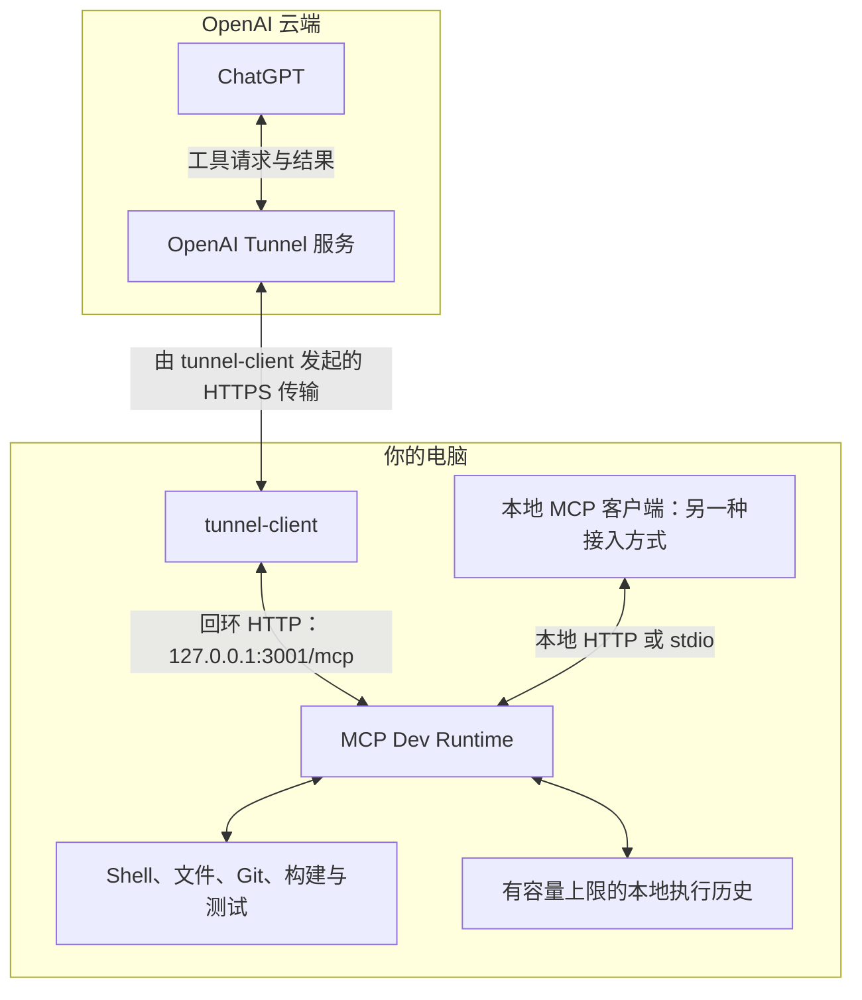

# MCP Dev Runtime

**让 MCP 客户端直接使用你自己的开发环境。**

[English](../README.md) | **简体中文**

通过六个 MCP 工具，执行 Shell 命令、操作交互终端、应用文件补丁、读取图片、查询执行历史。既可以通过 HTTP 或 stdio 连接本地客户端，也可以借助可选的 OpenAI Secure MCP Tunnel 接入 ChatGPT。

**第一次接入 ChatGPT？** 先看[一步一步的新手图文教程](CHATGPT_SETUP.zh-CN.md)：开启开发者模式、创建 Tunnel 和 API Key、启动本机服务，再在 ChatGPT 中选择隧道。

这是独立的社区项目，不是 OpenAI 官方产品。运行时直接完成工具操作，**不启动 Codex、不委派给其他智能体、不调用模型 API**。它不是远程桌面查看器，也不提供鼠标、键盘和图形界面自动化服务。

> **使用边界：**命令以服务所在的系统用户权限执行。本项目没有沙箱、命令白名单、额外审批层或多用户隔离。请保留回环地址监听，只连接可信客户端。返回的文件内容、日志和图片会进入调用方客户端；本地执行不代表数据只在本地处理。连接电脑前请阅读 [SECURITY.md](../SECURITY.md)。

**预编译 v1.0.0：**[下载对应平台运行包](https://github.com/dolibali/mcp-dev-runtime/releases/tag/v1.0.0) · [安装与升级指南](BINARY_INSTALL.zh-CN.md)。内置 Node、原生依赖和固定版本 Tunnel，无需安装编译工具。本版暂不进行发布者签名和 Apple 公证。

## 目录

[选择接入方式](#connection) · [环境要求](#requirements) · [安装](#install) · [全局命令 / mdr](#global-command) · [本地 HTTP / stdio](#local) · [ChatGPT 部署](#chatgpt) · [工具能力](#tools) · [执行历史](#history) · [配置说明](#configuration) · [日常维护](#operations) · [日志目录与查看](#logs) · [常见问题](#troubleshooting) · [测试验证](#validation) · [文档索引](#documentation)

<a id="connection"></a>
## 选择接入方式

| 使用场景 | 连接路径 | 启动方式 |
| --- | --- | --- |
| 支持 HTTP 的本地 MCP 客户端 | 回环地址上的 Streamable HTTP | `npm start -- --config config.json` |
| 由客户端启动 MCP 子进程 | stdio | 在客户端配置 `node …/dist/main.js --transport stdio …` |
| ChatGPT 访问你的私人电脑 | OpenAI Secure MCP Tunnel → 本地 HTTP | `npm run up -- --env-file runtime.env --background` |



图中箭头表示**请求和结果的数据流**，不是谁主动建立入站网络连接。本机的 `tunnel-client` 主动向 OpenAI 建立出站 HTTPS 连接，接收任务后通过回环 HTTP 转给 MCP Dev Runtime，再返回结果。ChatGPT 不会直接连接你电脑的 `localhost`，也不需要开放公网入站端口。本地客户端是另一条接入路径，完全绕过 Tunnel，并非必须同时安装。仍需具备平台与工作区权限，原理见 [OpenAI 官方 Tunnel 指南](https://developers.openai.com/api/docs/guides/secure-mcp-tunnels)。

**同一实例只选一种启动方式。** `npm start` 只启动 MCP；`npm run up` 同时管理 MCP 和 Tunnel。两者都占用 3001 端口时会冲突。仅在本地使用 HTTP 或 stdio，不需要 Tunnel 凭据，也不需要 Go。

<a id="requirements"></a>
## 环境要求

推荐的**预编译发行版**只需匹配支持的平台和架构，不要求系统另装 Node/npm/Go/编译器，见[预编译安装](BINARY_INSTALL.zh-CN.md)。下表是**源码开发**的前置条件，不是运行包的安装要求。

| 依赖 | 何时需要 |
| --- | --- |
| [Node.js 24 或更高版本](https://nodejs.org/en/download)，包含 npm | 安装依赖、编译 TypeScript、运行服务 |
| Git | 克隆仓库、源码开发，以及可选的 Tunnel 源码获取 |
| ripgrep（`rg`） | 建议安装，用于高效代码搜索和工具链诊断 |
| Python 3 与 C/C++ 编译工具链 | 当前平台没有适用的预编译原生依赖时 |
| Go 与 `make` | **仅从源码构建 Tunnel 时需要**；当前固定源码的 `go.mod` 声明 Go **1.27.0** |

在准备启动服务的终端中检查：

```bash
node --version
npm --version
git --version
rg --version
```

macOS 上需要本地编译依赖时，可用 `xcode-select --install` 安装 Xcode Command Line Tools。Debian/Ubuntu 常见的本地编译依赖为 `build-essential`、`python3`、`pkg-config`；Node.js 请单独安装并确认版本满足要求。参考 [node-pty 编译依赖](https://github.com/microsoft/node-pty#dependencies)。不要用 `sudo` 运行本项目。

预编译包在 macOS 14 ARM64、macOS 15 Intel 和 Ubuntu 22.04 x64/ARM64 上分别进行原生验证；实际产物检查记录随 Release 的 `VERIFICATION.json` 提供，模拟 Tunnel 生命周期测试不代表真实云端连接。历史源码回归记录见 [VALIDATION.md](VALIDATION.md)。

<a id="install"></a>
## 一、安装

**推荐：**下载[预编译发行版](https://github.com/dolibali/mcp-dev-runtime/releases/tag/v1.0.0)，核对 SHA-256、解压并运行其中的 `./install.sh`。[预编译指南](BINARY_INSTALL.zh-CN.md)说明用户目录、命令、共存、升级和回退；这个安装器不编译或下载依赖。

### 源码开发替代方式

使用下面的地址克隆仓库；私有仓库需要使用具有访问权限的账号。使用 Fork 时，改为该 Fork 的克隆地址。如果使用下载后解压的源码包，跳过克隆，进入解压后的项目目录即可。

```bash
git clone https://github.com/dolibali/mcp-dev-runtime.git
cd mcp-dev-runtime
./install.sh
```

这个安装过程是本地执行、可重复运行的：安装锁文件指定的 npm 依赖、编译运行时、仅在文件不存在时创建 `config.json`、`launcher.config.json` 和 `runtime.env`，然后验证已有 Tunnel，或按 `tunnel.lock.json` 的精确提交拉取源码并构建 `tunnel-client-runtime` 到被忽略的 `.runtime/bin/<commit>/`。脚本不会自动运行 `sudo`、Homebrew 或 apt，也不会覆盖已有本地配置和凭据。

只需要本地 HTTP / stdio、不接 ChatGPT Tunnel 时，可以跳过 Tunnel：

```bash
./install.sh --local-only
```

也可以运行 `npm run setup`；给安装器传参数时仍使用 npm 的分隔符，例如 `npm run setup -- --local-only`。只有明确需要重新构建固定 Tunnel 时才运行 `./install.sh --force-tunnel-build`。完整选项见 `./install.sh --help`。

重复运行时，脚本通过被忽略的 `.runtime/setup/` 中的 package-lock 哈希判断是否需要再次执行 `npm ci`。如果确实需要刷新依赖，同时检测到受管服务仍可能在运行，安装器会拒绝在活动服务下面替换 `node_modules`；应先停止自己管理的活动任务，而不是强行覆盖。

从仓库根目录启动时，示例配置可以直接使用。需要操作其他项目时，编辑 `config.json`，将 `cwd` 设为**已经存在的工作目录绝对路径**。它只是默认目录，不是文件访问白名单。多个项目共用一个运行时，建议单独设置绝对的 `history.directory`，详见[配置说明](#configuration)。

源码编译需要开发依赖，安装过程还会准备当前项目的原生 PTY 辅助程序；当前平台没有适用预编译包时仍可能需要前面的系统编译依赖。`package.json` 中的 `private: true` 是为了防止误发到 **npm**，不妨碍在 GitHub 公开源码。不要假定运行 `npx mcp-dev-runtime` 就能安装到本项目。

<a id="global-command"></a>
### 在任意目录使用全局命令

两种安装方式提供同样的 CLI。预编译版使用内置 Node 和用户级配置；下面的 `npm run command:*` 说明专用于源码 checkout。预编译版移除入口使用 `./install.sh --unregister`，并保留原来的 prefix/bin 参数，见[预编译安装](BINARY_INSTALL.zh-CN.md)。

安装成功后，会在 `~/.local/bin/mcp-dev-runtime` 注册**当前用户的全局命令**。安装器还会自动尝试注册短命令 `mdr`；如果这个名字已被其他程序占用，只跳过短命令，不影响整个安装成功。两个入口都仍使用同一份源码、Node 程序、Tunnel 缓存和配置，不会复制第二套运行时，也不需要 `sudo`。注册后不要删除源码目录或对应 Node 安装。

已经装好的实例，可以只注册命令，不必重装依赖、修改凭据或重启服务：

```bash
npm run command:install
```

命令目录加入 PATH 后，不在源码目录也能执行：

```bash
mcp-dev-runtime --help
mcp-dev-runtime --version
mcp-dev-runtime status
mcp-dev-runtime doctor
mcp-dev-runtime doctor --json
mcp-dev-runtime smoke
```

`status` 提供三级输出：

```bash
mdr status
mdr status --verbose
mdr status --json
mdr paths
```

普通 `status` 是日常查看用的简洁摘要；`--verbose` 会补充进程 PID、实例 ID、延迟、内存、保留会话 / 历史大小以及 Tunnel 版本；`--json` 保留完整的机器可读 supervisor 对象，适合脚本和深度排障。长命令 `mcp-dev-runtime` 支持同样参数；通过 npm 使用时写成 `npm run status -- --json` 或 `npm run status -- --verbose`。

`mdr paths` 只显示当前这份安装真正解析并使用的路径，不预览假设中的未来目录，也不会迁移任何文件。源码版与预编译版均通过同一个命令显示实际生效的路径。需要机器可读结果时用 `mdr paths --json`。

为了每次启动不用重新填写凭据文件路径，把 `"env_file": "runtime.env"` 合并到**已有的** `launcher.config.json` 中，保留其他设置；这个值是文件名，不是 API Key。之后在任意目录都可以运行 `mcp-dev-runtime up --background` 和 `mcp-dev-runtime down`。显式传入 `--env-file FILE` 时，相对路径按终端当前目录解析，必要时使用绝对路径。注册命令本身不读取或修改 `runtime.env`，也不启动或停止服务。

管理命令读取安装目录的配置，并以该安装目录作为工作目录解析基准，不会误用当前其他项目里的同名文件。显式路径参数仍相对于调用目录。`mcp-dev-runtime serve` 则保留终端当前目录，供本地 HTTP / stdio 使用。全局 `smoke` 会根据选中的配置生成目标 URL；旧的 `npm run smoke` 在非默认端口时仍需显式传入 URL。

如果 `~/.local/bin` 尚未加入 PATH，安装器会输出准确的 export 命令。使用默认目录时是：

```bash
export PATH="$HOME/.local/bin:$PATH"
```

把这行加入对应 Shell 的启动文件，可以让后续终端也生效；安装器**不会擅自修改** `.zshrc`、`.bashrc` 等文件。同名但不属于本项目的命令不会被覆盖；PATH 中有优先命令时会明确提示。入口使用注册时选定的 Node；主动删除或迁移该 Node 版本后，应使用兼容的新 Node 重新注册。

只移除当前源码目录注册的命令，可在仓库中运行 `npm run command:uninstall`，不会删除配置、Tunnel、历史或停止服务。迁移源码目录前先移除入口，再从新位置注册；安装器不会默默把旧入口改指向另一份源码。高级安装可以指定 `npm run command:install -- --bin-dir /absolute/path/to/bin`，卸载时使用相同的 `--bin-dir`。CI 或嵌入式部署不需要全局入口时，用 `./install.sh --no-global-command` 跳过注册。

<a id="short-command"></a>
#### 短命令：`mdr`

`mdr` 适合作为 **MCP Dev Runtime** 的日常缩写，但不是独占名称：[CleverCloud/mdr](https://github.com/CleverCloud/mdr)、[michaelsanford/mdr](https://github.com/michaelsanford/mdr) 等 Markdown 工具已在使用它。因此项目名、包名和正式命令仍保留 `mcp-dev-runtime`。

正常执行 `./install.sh` / `npm run setup` 时，安装器会自动检查 `mdr`。没有冲突时会同时注册：

```bash
mcp-dev-runtime --version
mdr --version
```

如果当前 PATH 任意位置已经有其他 `mdr` 可执行文件，或者目标位置已有无关文件、目录或符号链接，安装器会提示“已跳过短命令”，继续保留 `mcp-dev-runtime` 并完成安装；不会执行、覆盖或删除对方程序。子进程看不到当前交互 Shell 的别名或函数，因此遇到 Shell 层冲突时仍可运行 `type -a mdr` 排查。自动检测只代表安装当时的 PATH，未来安装其他软件或切换 Shell 环境仍可能产生新冲突。

旧安装，或者原有冲突已经正常消失后，可以在项目目录单独重试短入口：

```bash
npm run command:install -- --name mdr
```

注册成功且命令目录已加入 PATH 后，短命令与长命令使用同一份安装和服务：

```bash
mdr --help
mdr --version
mdr status
mdr doctor --json
mdr smoke
```

其他子命令也保持一致，例如 `mdr up --background` 和 `mdr down`；原有凭据配置仍然适用。`mdr --version` 会显示项目名 `mcp-dev-runtime`，不是重命名后的另一个包。**不要运行 `npm install -g mdr` 来安装本项目**，它安装的是[另一个 Markdown 阅读器](https://github.com/mrchimp/mdr)。

只移除短入口时运行 `npm run command:uninstall -- --name mdr`。移除长入口不会连带删除短入口，反之亦然；自定义命令目录需传入相同的 `--bin-dir`。移除入口不会停止服务，也不会删除配置、日志或历史。注册选项可通过 `npm run command:install -- --help` 查看。

<a id="npm-arguments"></a>
**命令中间的 `--` 是什么意思？** 在 `npm run doctor -- --json` 中，`npm run doctor` 选择本项目的诊断脚本，单独的 `--` 告诉 npm 将后面的参数传给脚本，`--json` 才是脚本的输出选项。这不是笔误，也不是可以随意删除的多余横线。日常人工检查直接运行 `npm run doctor` 即可；需要脚本输出 JSON 时再加 `-- --json`。它调用的脚本是 `node scripts/doctor.mjs --json`；直接使用 Node 时不需要 npm 的分隔符。参考 [npm 官方参数传递说明](https://docs.npmjs.com/cli/v12/commands/npm-run/)。

全局命令不经过 npm，直接写 `mcp-dev-runtime doctor --json` 即可，不需要中间的分隔符。

<a id="local"></a>
## 二 A、连接本地客户端

### HTTP 方式

启动服务并保持当前终端打开：

```bash
npm start -- --config config.json
```

在**第二个终端**进入仓库根目录，执行：

```bash
npm run doctor -- --config config.json
npm run smoke
```

在支持该传输方式的本地客户端中，使用 **Streamable HTTP** 和地址 `http://127.0.0.1:3001/mcp`；具体配置格式以该客户端为准。`/healthz` 是健康检查地址，不是 MCP 地址。`smoke` 会验证工具发现并执行无害测试命令。

停止独立 MCP 服务时，在服务所在终端按 Ctrl+C；`npm run down` 只控制统一启动器管理的实例。

### stdio 方式

让 MCP 客户端直接启动并管理服务子进程，不必另外启动 HTTP 服务。常见的 `mcpServers` 配置示例如下，外层格式取决于客户端：

```json
{
  "mcpServers": {
    "mcp-dev-runtime": {
      "command": "/absolute/path/to/node",
      "args": [
        "/absolute/path/to/mcp-dev-runtime/dist/main.js",
        "--transport", "stdio",
        "--config", "/absolute/path/to/mcp-dev-runtime/config.json",
        "--cwd", "/absolute/path/to/workspace"
      ]
    }
  }
}
```

所有示例路径都需要替换。运行 `node -p process.execPath` 可取得 Node 可执行文件路径；图形客户端不一定继承终端的 PATH。工作目录和历史目录建议使用绝对路径，避免因客户端启动位置不同而改变。

stdio 的标准输出承载协议，不要额外添加欢迎语等普通文本。多个并发实例必须使用不同的历史目录。关闭客户端可能同时停止它管理的 stdio 子进程及该进程创建的活动任务。

<a id="chatgpt"></a>
## 二 B、通过 Secure MCP Tunnel 接入 ChatGPT

先完成[源码安装](#install)。启动受管服务前，停止占用相同端口的独立 MCP。工具发现和后续调用期间，需要 MCP 与 Tunnel 都保持运行。网页菜单、每个字段怎么填以及参考截图，详见[完整新手教程](CHATGPT_SETUP.zh-CN.md)。

### 第 1 步：准备权限和凭据

在 [Platform Tunnels](https://platform.openai.com/settings/organization/tunnels) 创建或选择**你自己的** Tunnel，并关联目标组织和工作区。创建需要 Tunnels **Read + Manage**；运行和选择需要 **Read + Use**。ChatGPT 开发者模式权限与此分开管理。权限不足时参考[官方权限说明](https://github.com/openai/tunnel-client/blob/master/docs/permissions.md)。

**Tunnel ID 在 Tunnels 页面复制，不在 API keys 页面生成。** 另行打开 [Organization → API keys](https://platform.openai.com/settings/organization/api-keys?utm_source=chatgpt.com)，创建 **Restricted 运行时 API Key**，按照[官方权限说明](https://github.com/openai/tunnel-client/blob/master/docs/permissions.md)授予 Tunnels **Read + Use**。不要用管理员密钥作为长期运行凭据。[图文教程](CHATGPT_SETUP.zh-CN.md#step-3)说明了两个值分别从哪里取得，以及如何关联正确工作区。实际权限以账号和工作区当前开放情况为准，安装本项目不会自动获得权限。

### 第 2 步：确认固定版本 Tunnel 已准备好

推荐的 `./install.sh` 已经会复用匹配的 Tunnel，或按照 `tunnel.lock.json` 自动获取并构建精确固定源码。先检查安装结果：

```bash
npm run tunnel:setup
```

如果之前使用了 `--local-only`，或因为缺少 Git / Go / make 而没有完成 Tunnel 准备，安装好对应系统前置条件后重新运行普通安装即可。明确需要重新构建固定版本时：

```bash
./install.sh
# 只有明确需要强制重建时：
./install.sh --force-tunnel-build
```

真正需要源码构建时才要求 Git、`make` 和满足上游固定 `go.mod` 的 Go 工具链；安装器只检查并提示，不会自动修改系统软件。启动器会检查 [tunnel.lock.json](../tunnel.lock.json) 中记录的精确源码对应关系，只比对上游版本号不足以确认兼容。构建的是精简 `tunnel-client-runtime`，不会安装未经校验的 `latest`。

### 第 3 步：填写本机凭据文件

`./install.sh` 只会在 `runtime.env` 不存在时从公共占位模板创建它，并将权限设置为仅当前用户可读写的 `0600`。在本机编辑这个文件，替换两个占位值：

```dotenv
CONTROL_PLANE_TUNNEL_ID=tunnel_00000000000000000000000000000000
CONTROL_PLANE_API_KEY=replace-with-your-own-runtime-key
```

全零的 ID 只是示例，不是可用 Tunnel。真实 ID 的格式为 `tunnel_` 加 32 位小写十六进制字符。不要将真实密钥放进 Git、公开 issue、截图或命令行参数。

已经导出的非空凭据环境变量优先于 env 文件。`runtime.env` 按数据解析，不展开 `$HOME`，不执行 `source` 或命令替换。启动器会从 MCP 子进程环境中移除控制面密钥，但这不是安全沙箱。

可在 `launcher.config.json` 中加入 `"env_file": "runtime.env"`，这样后续启动可以省略 `--env-file`。自定义 `tunnel_bin` 也可写入该文件；其中的相对路径以配置文件所在目录为基准。

### 第 4 步：启动并验证

```bash
npm run up -- --env-file runtime.env --background
npm run doctor
npm run smoke
```

预期 `doctor` 显示 `PASS`，其中 `runtime.ok`、`protocol.ok` 为 true，对应受管实例的 `health.availability` 为 `ready`。还应检查各项工具链结果和历史存储告警。从本仓库运行时，`doctor` 会根据 `launcher.config.json` 选择运行时配置；未指定时，会使用本仓库已存在的 `config.json`。检查其他安装位置时，使用 `-- --config FILE` 或 `-- --launcher-config FILE` 明确指定。`smoke` 另外对默认端点执行一次无害命令。这些仍是**本地检查**，不能替代 ChatGPT 到电脑的一次真实调用。

需要查看生命周期详情时运行 `npm run status`。两条原始 `curl` 探测保留为可选的分层排障手段，不再作为额外必做步骤；见[端口与直接探测](DEPLOYMENT.md#ports)。

需要前台运行时去掉 `--background`，之后按 Ctrl+C 会停止两个受管服务。凭据明确由正常登录 Shell 提供时，可以改用 `npm run up -- --shell-env --background`；只有缺少必要凭据时，启动器才加载登录 Shell 环境。

重复 `up` 只返回现有实例，不会让新配置自动生效。后台模式可在关闭启动终端后运行，但**不会安装 launchd/systemd 或开机服务**，也不能让已经睡眠的电脑继续在线。

### 第 5 步：在 ChatGPT 中连接和测试

在 ChatGPT 网页版打开 **设置 → 安全与登录（Security and login）→ 开发者模式（Developer mode）**，然后进入 [Plugins](https://chatgpt.com/plugins)，点击**加号**创建开发者应用。部分工作区仍使用 **设置 → Apps → Advanced Settings**，再从 **Apps → Create** 创建；受管理工作区可能需要管理员先授权。[新手教程](CHATGPT_SETUP.zh-CN.md#step-1)列出了两种入口及官方依据。

名称填写 `mcp-dev-runtime`；**Connection 选择 Tunnel，不选 Server URL**，并选择与本机配置相同的 Tunnel ID。本项目默认回环服务的 MCP 认证选择 **No Authentication**；运行时 API Key 负责的是另一层 Tunnel 认证，不能粘贴进 OAuth 字段。表单提供 **Scan Tools** 时点击扫描，核对六个工具后再 **Create**；采用自动发现的界面则在发现阶段核对结果。[逐字段教程](CHATGPT_SETUP.zh-CN.md#step-7)也解释了为什么官方参考图显示 OAuth，而本项目默认部署不使用它。

在对话中选中应用，先测试无害命令：

> 使用 MCP Dev Runtime 执行 `pwd` 和 `printf 'mcp-ready\n'`，返回实际输出与退出码，不要修改任何文件。

升级后需要刷新或审核客户端缓存的工具定义。检查 `exec_command` 的 `label`、`capture_output`；`list_exec_sessions` 的 `scope`；`write_stdin` 的 `archive_id`、`tail_lines`、`search`。本地重启与客户端刷新是两件不同的事。

<a id="tools"></a>
## 六个工具覆盖开发流程

| 工具 | 能力 |
| --- | --- |
| `exec_command` | 执行 Shell、读取与搜索文件、Git、构建、测试；可选 PTY、任务标签、输出落盘 |
| `write_stdin` | 交互输入、增量日志、显式重放、只读尾部与搜索、历史日志读取 |
| `apply_patch` | Codex 风格的新增、修改、删除、移动补丁，支持多文件和多个修改块 |
| `view_image` | 返回真实 PNG/JPEG/WebP 图片内容，带大小限制和可选缩放 |
| `list_exec_sessions` | 查询当前会话或磁盘历史，按目录、标签、结果筛选 |
| `terminate_exec_session` | 终止运行时自己创建的命令并确认退出，不是任意系统进程控制接口 |

所有工具都声明输入、输出 Schema。命令正文优先读取 `structuredContent.output`；为兼容旧客户端，文本返回中也保留相同片段。**选择一个通道读取，不要把两者拼接。** 双通道增加的是传输表示，不会再执行一次命令。

`yield_time_ms` 是一次调用最多等待多久，不是命令寿命；`timeout_ms` 才是独立执行超时。长任务使用返回的 `session_id` 继续读取，不要重新启动同一条命令。非零退出码属于真实命令结果，还应结合 `isError`、进程状态和输出判断。多文件补丁经过预检查，但**不保证跨文件原子性**。详见[工具说明](TOOLS.md)和[输出契约](OUTPUT_CONTRACT.md)。

<a id="history"></a>
## 执行历史和重点日志

已完成会话**默认不按经过时间过期**，但仍受容量限制。磁盘历史与活动进程状态是两层不同的数据。

| 默认配置 | 数值 |
| --- | --- |
| 活动执行会话 / 已完成内存记录 | 8 / 512 |
| 单会话 / 全部会话内存日志 | 8 MiB / 64 MiB |
| 按时间淘汰 | 默认关闭：`exec.retained_session_ms: null` |
| 磁盘历史条数 / 总容量 | 4,096 / 256 MiB |
| 单任务落盘日志 / 待写入队列 | 16 MiB / 1 MiB |
| 命令预览 / 原始输出默认落盘 | 均关闭；保存元数据与显式标签 |

需要日后查看构建或测试日志时，在启动阶段调用 **`exec_command`**，将目录替换为已经存在的项目路径：

```json
{
  "cmd": "npm test",
  "workdir": "/absolute/path/to/project",
  "label": "project/tests",
  "capture_output": true,
  "yield_time_ms": 1000
}
```

保留返回的 `session_id` 和 `archive_id`。之后用 **`list_exec_sessions`** 查询历史：

```json
{"scope":"history","label":"project/tests","order":"desc","limit":10}
```

下面每段都是 **`write_stdin`** 的独立参数示例。`123` 和档案字符串都需要替换为实际返回的标识：

```json
{"session_id":123,"tail_lines":100,"max_output_tokens":4000}
```

```json
{"session_id":123,"search":"error","max_matches":20}
```

```json
{"session_id":123,"archive_id":"<returned-archive-id>","tail_lines":100}
```

尾部查询和区分大小写的字面搜索只读、不推进默认游标。搜索结果在 `matches` 中，继续搜索时将 `search_next_cursor` 作为 `output_cursor`。普通历史分页则显式使用 `next_output_cursor`。

只保存元数据的记录没有原始日志可读。必须在**任务开始时**开启输出保存，不能补造已经丢失的日志。注意 `output_gap`、`tail_truncated`、`archive_truncated` 和 `history_warning`：已存日志可能只是一个不完整前缀，`has_more: false` 不能证明完整保存。

重启后，旧实例未确认最终结果的任务会显示为 `unknown`，不等于成功、失败或可恢复的终端。配额范围内的历史可以跨重启查询，旧进程句柄和去重保证则不能跨重启恢复。详细行为见[执行历史与恢复](HISTORY_AND_RECOVERY.md)。

<a id="configuration"></a>
## 配置文件与路径规则

| 文件 | 用途 | 是否提交 Git |
| --- | --- | --- |
| `config.example.json` | 公共运行时默认配置 | 是 |
| `config.json` | 你本机的运行时设置和路径 | 否 |
| `launcher.config.example.json` | 公共启动器默认配置 | 是 |
| `launcher.config.json` | 本机运行时配置路径、状态目录、可选程序与 env 路径 | 否 |
| `.env.example` | 凭据占位符和代理示例 | 是，仅含占位值 |
| `runtime.env` | 真实运行凭据 | **禁止** |
| `tunnel.lock.json` | 公共版本与源码提交绑定 | 是 |

<a id="ports"></a>
### 默认端口

| 监听服务 | 默认地址 | 确有需要时修改的字段 |
| --- | --- | --- |
| 本地 MCP，包含 `/mcp` 和 `/healthz` | `127.0.0.1:3001` | `config.json` 顶层的 `port` |
| Tunnel 健康检查，包含 `/readyz` | `127.0.0.1:9098` | `launcher.config.json` 中的 `tunnel_health_port` |

这是可配置的项目默认值，不是专门为本项目保留的端口，也不保证永远没有冲突。已经正常工作的安装可以保持不变。出现冲突时，只停止已确认归属的重复实例，或选择未占用且互不相同的本地端口；不要用改成 `0.0.0.0` 监听或开放公网防火墙端口的方式处理。换端口本身不是安全措施。

先检查活动任务，再停止服务、修改已有本地 JSON 字段，并使用同一启动器配置重启。受管启动器会根据运行时配置生成 MCP 转发地址；修改这些本地端口不改变 Tunnel ID。直接 HTTP 客户端的 URL 需要同步更新，`smoke` / `verify:deployed` 也要显式传入新 URL，它们不会自动读取 `config.json`。只改 `curl` 命令里的地址不会改变服务端口。详细步骤见[端口调整说明](DEPLOYMENT.md#ports)。

运行时命令行参数优先于运行时 JSON。运行时 `cwd` 相对**进程启动目录**解析，不相对 JSON 文件所在目录；相对的 `history.directory` 再以解析后的 `cwd` 为基准。

启动器 JSON 中的相对路径，以**启动器配置文件所在目录**为基准；命令行路径覆盖项则以执行命令的终端目录为基准。部署时建议使用绝对的工作目录和历史目录。

例如，替换真实路径后，将以下设置合并进本地运行时配置：

```json
{
  "cwd": "/absolute/path/to/workspace",
  "shell": "/bin/bash",
  "history": {
    "directory": "/absolute/path/to/private-runtime-history",
    "record_command": false,
    "record_output": false
  }
}
```

历史不要进入源码管理。默认的 `.mcp-dev-runtime/` 和 `.runtime/` 已被忽略，但任意自定义目录不会自动获得相同保护。每个历史目录只能有一个活动写入者，独立 HTTP、stdio 实例不能共用。配置拒绝未知字段，完整运行时 Schema 见 [contracts/runtime-config.schema.json](../contracts/runtime-config.schema.json)。

使用出站代理时，可在 `runtime.env` 或启动环境中设置合适的 `HTTPS_PROXY`/`HTTP_PROXY`，并设置 `NO_PROXY=localhost,127.0.0.1,::1`。不要用关闭 TLS 校验来解决证书问题。环境变量和连接设置变更后，应停止再启动服务。

<a id="operations"></a>
## 停止、重启、升级与清理历史

停止前，通过 `list_exec_sessions` 分别检查 `state: "running"` 和 `state: "terminating"`。停止服务也会停止它自己创建的活动命令。

```bash
npm run status
npm run down
# 检查配置修改后再启动：
npm run up -- --env-file runtime.env --background
```

`down` 只操作选中的受管实例。使用自定义状态目录时，`up`、`status`、`down` 都应传入相同的 `--state-dir`，或统一使用同一份启动器配置。它不会接管无关监听服务，也不会仅凭旧 PID 文件就结束某个系统进程。

**预编译版升级**使用[版本目录安装与回退流程](BINARY_INSTALL.zh-CN.md#升级回退与源码版共存)，不要在运行包里执行 `npm ci`。

升级源码时，先审阅并保存自己的修改、停止活动任务，在私有位置备份本地配置和需要保留的历史，再切换到经过审阅的发布版本或提交。**不要用示例配置覆盖现有配置。** 然后执行：

```bash
npm ci --include=dev
npm run build
npm run test:all
# 以下步骤仅用于受管 Tunnel 接入：
npm run tunnel:setup
npm run up -- --env-file runtime.env --background
npm run doctor -- --config config.json --json
```

升级涉及 Tunnel 源码提交变更时，应先更新子模块，再显式构建或校验匹配程序，不要为了绕过不匹配而修改锁文件。完成本地验证后刷新客户端工具定义。回滚时保留旧源码、旧配置及私有历史备份；不要假定旧版本一定能理解将来的历史格式。

需要**主动删除**当前配置对应的磁盘执行历史时，先停止该目录的写入者，再执行：

```bash
node dist/launcher/cli.js history-clear --config config.json --confirm
```

这个操作会删除选定历史，存在活动写入者时会拒绝；不会删除源码或其他命令生成的无关文件。关闭日志捕获不会自动删除以前保存的数据。

临时就绪探测失败只更新状态，不重跑命令；受管子进程实际退出时，仍执行协调关闭。更多细节见[部署说明](DEPLOYMENT.md)。

<a id="logs"></a>
## 日志目录、查看方法与错误排查

通过启动器 `up` 管理的服务，用 `mdr paths` 查看真实的 **Logs** 目录。预编译版在 macOS 使用 `~/Library/Logs/mcp-dev-runtime`，Linux 使用用户 XDG 状态目录；源码版默认仍是源码旁的 `.runtime/`。`logs_dir` 可将日志与 supervisor 状态分离；旧源码或自定义配置未指定时仍沿用 `state_dir`。下表是源码默认路径，预编译版应使用实际显示的 Logs 路径。

| 默认路径，相对于安装目录 | 内容 |
| --- | --- |
| `.runtime/mcp.log` | MCP 服务诊断、启动消息和错误 |
| `.runtime/tunnel.log` | Tunnel 连接、就绪状态和网络诊断 |
| `.runtime/launcher.log` | 后台启动器输出，由 `up --background` 创建 |
| `.runtime/mcp.log.1`、`.runtime/mcp.log.2` | 已发生轮转时保留的较旧 MCP 日志 |
| `.runtime/tunnel.log.1`、`.runtime/tunnel.log.2` | 已发生轮转时保留的较旧 Tunnel 日志 |

**没有单独的 `error.log`**，服务错误与对应组件的诊断一起记录。先运行 `mcp-dev-runtime status`、`mcp-dev-runtime doctor`（注册短命令后也可用 `mdr status`、`mdr doctor`），再查看相关文件：后台启动失败看 `launcher.log`，MCP 进程或协议问题看 `mcp.log`，Tunnel 输出的连接、认证、代理 / TLS 问题看 `tunnel.log`。受管子进程的 stdout 和 stderr 合并到对应日志，不会把 warning 和 error 另外拆成一个文件。

先将示例路径替换为你的安装目录，再查看最近的服务日志：

```bash
cd /path/to/mcp-dev-runtime
tail -n 100 .runtime/mcp.log .runtime/tunnel.log
```

持续查看新输出，并在日志轮转后继续跟随：

```bash
tail -F .runtime/mcp.log .runtime/tunnel.log
```

按 **Ctrl+C** 只会停止查看日志，不会停止 MCP 或 Tunnel。排查后台启动失败时，也可以执行 `tail -n 100 .runtime/launcher.log`。相关组件尚未启动或尚未输出第一条消息时，日志文件可能还不存在；只使用前台启动不会创建 `launcher.log`。`tail -F` 可以继续等待文件出现。Tunnel 默认记录 warning 及以上级别，因此日志为空或尚未创建，本身不代表故障。

仍在安装目录中，可用下面的命令同时搜索当前和已经轮转的日志，显示行号及前后三行上下文：

```bash
grep -nEi -C 3 'error|failed|failure|exception|panic|timeout|timed out|ECONN|EADDR|ENOTFOUND|EACCES|401|403' .runtime/*.log*
```

关键词搜索不是错误判定器：没有命中不代表服务健康，`grep` 没有匹配时正常返回退出码 1；命中一个词也不一定代表服务不可用。保留前后上下文，对照出错操作的时间和当前 `doctor` 结果。改过状态目录时，使用下面说明的实际路径，不要继续照抄 `.runtime/`。不要直接分享 `runtime.env` 或完整私人日志，先检查并脱敏路径、命令内容、Tunnel ID 和秘密值。

**改过目录时：**所选 `launcher.config.json` 的 `logs_dir` 决定日志路径；源码或自定义配置未指定时，日志仍沿用 `state_dir`。JSON 中的相对路径以该配置文件为基准，命令行 `--state-dir` 的相对路径以调用目录为基准。`up`、`status`、`down` 要使用相同的配置或覆盖项。普通 `mcp-dev-runtime status` / `mdr status` 会显示解析后的日志目录；`status --json` 会在 `logs[].file` 中给出 MCP / Tunnel 日志的绝对路径。自定义安装应以这些实际路径为准，不能继续假定是 `.runtime/`。

当前源码 checkout 有意把 `.runtime/` 放在项目目录中。预编译版已经把可变数据放在程序目录外，`mdr paths` 在两种模式下都只显示实际生效的目录。

**服务日志不等于命令输出历史。**构建、测试或 Shell 命令失败时，应查看工具返回的 `output` 和真实 `exit_code`，必要时用 `write_stdin` 继续读取该会话。磁盘执行历史默认在运行时配置的 `cwd` 下的 `.mcp-dev-runtime/history/`；运行时配置中的 `history.directory` 可以将其改到其他位置，例如 `.runtime/history/`。默认不保存工具的原始 stdout/stderr，需要保留某次构建日志时，在启动任务时设置 `capture_output: true`，再通过[历史工具](#history)查询有容量上限的档案，而不是到 `mcp.log` 中找每一条构建输出。

MCP 与 Tunnel 的诊断日志按写入量轮转：启动器配置的 `log_max_bytes` 默认 10 MiB，`log_files` 默认每条日志流保留三份，包含当前文件。低频的后台 `launcher.log` 单独在启动时轮转。独立 `npm start` / `serve` 的输出在对应终端，stdio 诊断在启动客户端的 stderr；这些方式不会自动生成受管服务的日志文件。日志和历史可能包含私人路径、代码或凭据，不应提交 Git，分享前需要审阅并脱敏。

<a id="troubleshooting"></a>
## 常见问题

| 现象 | 检查与处理 |
| --- | --- |
| `./install.sh: Permission denied` | 某些 ZIP / 图形解压方式会丢失 Unix 可执行位。确认源码可信后运行 `bash install.sh`，或执行 `chmod +x install.sh` 再重试。 |
| 找不到 `dist/main.js` 或 TypeScript 编译器 | 在源码目录运行 `npm ci --include=dev`、`npm run build`。 |
| PTY 或图片原生依赖安装失败 | 检查 Node 版本、CPU 架构和本地编译依赖。PTY 辅助文件缺少可执行位时可运行 `node scripts/prepare-pty.mjs`，不要大范围修改系统权限。 |
| 找不到兼容 Tunnel 程序 / 版本不匹配 | 运行 `tunnel:setup`；构建固定源码，或显式指定可信且匹配的程序。 |
| `go.mod requires go …` | 使用满足固定模块要求的 Go 工具链；仅本地运行 MCP 不需要 Go。 |
| 3001 或 9098 端口已占用 | 检查是否同时启动了独立 MCP 和受管服务，停止确认归属的进程，不要批量杀进程。 |
| 凭据缺失 / 401 / 403 | 核对 env 文件路径、继承环境变量优先级、运行密钥权限和组织/工作区关联，不要在问题报告中贴密钥。 |
| ChatGPT 看不到 Tunnel / 扫描失败 | 检查 Tunnel 就绪、目标工作区及官方权限要求。本地 HTTP 不能替代云端到电脑的 Tunnel 接入。 |
| 升级后没有新参数 | 先重启服务加载新代码，再刷新或审核客户端缓存的工具定义。 |
| `SESSION_LIMIT` / `UNKNOWN_SESSION` | 检查活动任务或磁盘历史；缺少缓存记录不代表应该重新执行有副作用的命令。 |
| `OUTPUT_NOT_RECORDED` / `HISTORY_NOT_FOUND` | 当时没有开启输出保存，或档案已被容量轮转移除；未来重要任务在开始时开启捕获。 |
| 历史 `degraded` / `archive_truncated` | 查看告警、剩余空间、配额和写入者归属；命令可能执行正常，但档案不可用或不完整。 |

优先运行 `npm run doctor -- --json`，分享**脱敏后的**诊断摘要，不要直接公开完整私人日志。更多情况见[故障排查](TROUBLESHOOTING.md)。

<a id="validation"></a>
## 开发与验证

| 命令 | 验证范围 |
| --- | --- |
| `npm run test:all` | 临时工作目录中的单元、协议、启动器回归测试 |
| `npm run verify:cli` | 独立生产 CLI 的启动、发现和关闭 |
| `npm run smoke` | 正在运行的默认本地端点的轻量检查 |
| `npm run verify:deployed` | 正在运行的端点上的六工具验收，使用临时文件和测试自建进程 |
| `npm run benchmark` | 本机运行时/HTTP 测量，不是 ChatGPT 或广域网延迟 |

非默认端点可向 `smoke` 或 `verify:deployed` 传入地址，例如 `npm run smoke -- http://127.0.0.1:3011/mcp`。不要对无权控制的端点运行部署验收。

发行准备已通过 **195 项源码回归**和独立生产 CLI 验证。预编译流水线对实际压缩包进行原生验证，覆盖 **13 组安装包验收及 20 项真实工具检查**；最终证据随 Release 的 `VERIFICATION.json` 提供。[VALIDATION.md](VALIDATION.md) 中较早的压力和延迟数字是历史检查点，不是可靠性或吞吐量保证。安装包 CI 不代表已验证物理睡眠唤醒、真实广域网中断、多日运行或断电持久性。

自动化测试不使用模型 API 或贡献者凭据。启动器测试使用明确标注的模拟 Tunnel，不代表已经连接 OpenAI。仓库包含 Ubuntu/macOS CI 和手动源码打包工作流。

<a id="documentation"></a>
## 文档索引与许可证

| 文档 | 内容 |
| --- | --- |
| [English](../README.md) | 完整英文安装与部署指南 |
| [ChatGPT 新手图文教程](CHATGPT_SETUP.zh-CN.md) / [English tutorial](CHATGPT_SETUP.md) | 网页入口、开发者模式、API Key、Tunnel ID 与首次调用 |
| [部署说明](DEPLOYMENT.md) | 路径、环境变量、生命周期与诊断边界 |
| [工具说明](TOOLS.md) / [输出契约](OUTPUT_CONTRACT.md) | 输入、输出、错误和续读语义 |
| [历史与恢复](HISTORY_AND_RECOVERY.md) | 存储、隐私、尾部/搜索和重启行为 |
| [技术架构](ARCHITECTURE.md) / [版本策略](VERSIONING.md) | 实现方式与固定版本兼容规则 |
| [验证记录](VALIDATION.md) / [更新日志](../CHANGELOG.md) | 已执行的验证与版本变化 |
| [维护者发布流程](RELEASING.md) / [参与贡献](../CONTRIBUTING.md) | 维护者参考，安装和使用无需执行 |

本项目使用 [Apache-2.0](../LICENSE)，重新分发时应保留 [NOTICE](../NOTICE) 和[第三方声明](../THIRD_PARTY_NOTICES.md)。Codex 工具用语与补丁语法仅作为参考，不代表使用 Codex 后端或获得官方背书。分发前请阅读[安全说明](../SECURITY.md)。

外部接入资料核对日期为 **2026-09-20**。供应方界面、权限和条款可能变化，请以链接中的官方资料为准。本运行时不调用模型，也不设置 SaaS 月度调用配额，但这**不代表任何托管、Tunnel、ChatGPT 或 API 服务都无限免费**。
